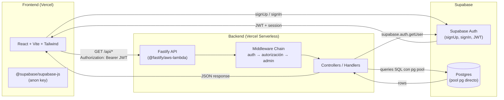
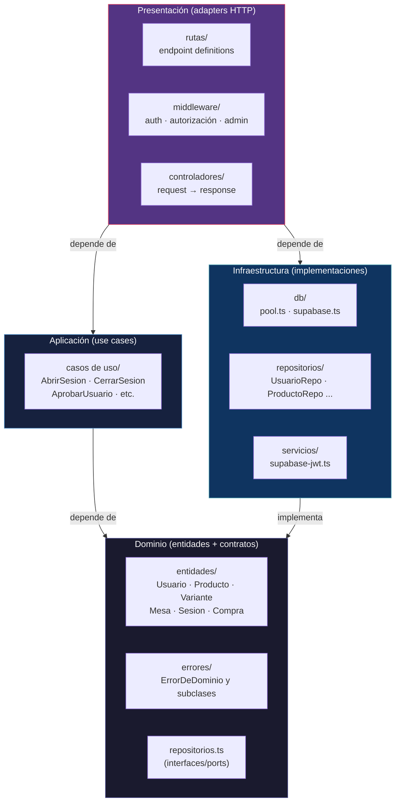
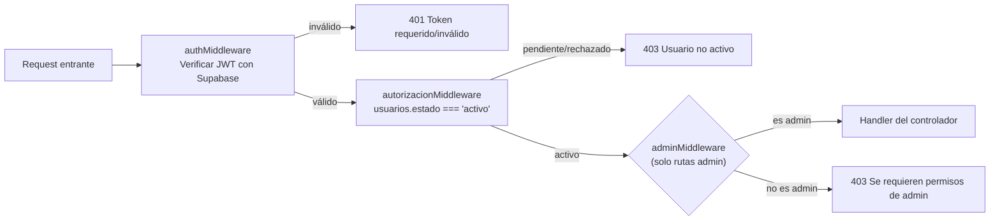
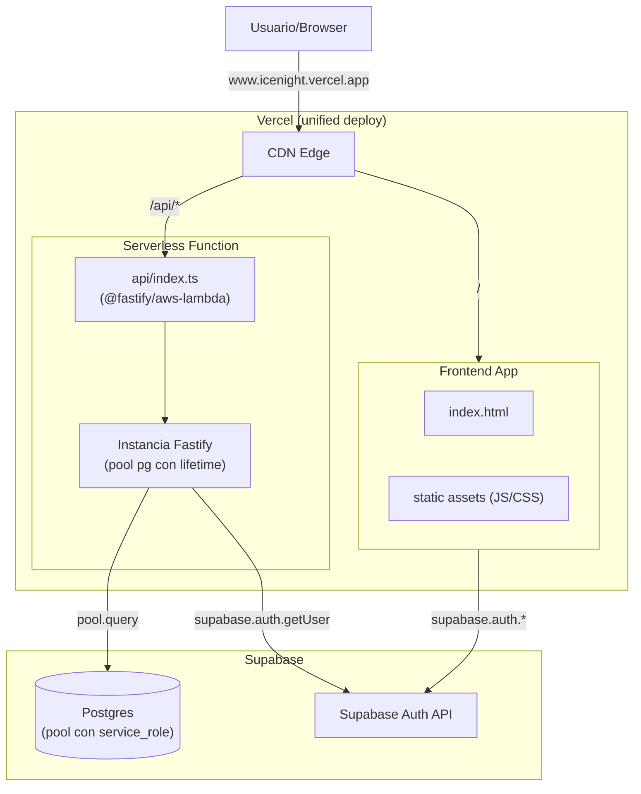
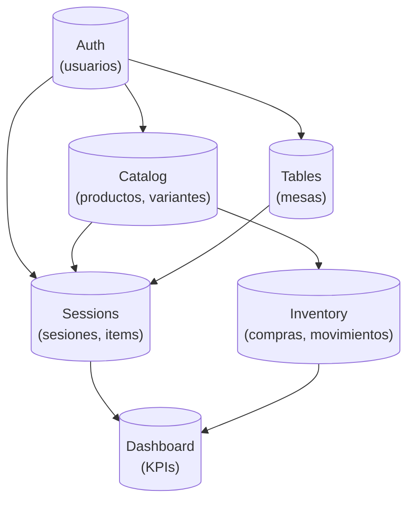

# Arquitectura — ICE NIGHT ERP

## Vista General: Flujo de 3 Capas



> **Nota**: El frontend se comunica DIRECTAMENTE con Supabase Auth para registro/login.  
> El backend solo verifica JWTs y maneja datos de negocio en `public` tables.  
> Ver [auth-flow.md](flows/auth-flow.md) para el detalle completo.

---

## Clean Architecture — Capas



### Reglas de dependencia

| Dirección | Permitido | Prohibido |
|-----------|-----------|-----------|
| **Dominio** → nada | Depende solo de TypeScript stdlib | No importa de infraestructura, frameworks, DB |
| **Aplicación** → Dominio | Importa entidades, interfaces de repositorio, errores | No importa de Express/Fastify, DB drivers, HTTP |
| **Infraestructura** → Dominio | Implementa interfaces de repositorio, servicios | No define nuevas entidades de negocio |
| **Presentación** → Aplicación + Infraestructura | Conecta rutas con casos de uso y middleware | No contiene lógica de negocio |

---

## Middleware Chain

Toda request protegida pasa por una cadena de middlewares en orden estricto:



### Middleware por ruta

| Ruta | authMiddleware | autorizacionMiddleware | adminMiddleware |
|------|:---:|:---:|:---:|
| `GET /api/health` | — | — | — |
| `GET /api/auth/perfil` | ✅ | — | — |
| `GET /api/admin/usuarios/pendientes` | ✅ | ✅ | ✅ |
| `PATCH /api/admin/usuarios/:id/estado` | ✅ | ✅ | ✅ |
| Rutas protegidas futuras | ✅ | ✅ | — |

> **Nota**: `GET /api/auth/perfil` NO requiere autorización activa — los usuarios con estado `pendiente` necesitan consultar su perfil para saber si fueron aprobados.

---

## Arquitectura de Deploy (Vercel Serverless)



### Configuración Vercel

```json
{
  "buildCommand": "cd backend && npm run build",
  "outputDirectory": "backend/dist",
  "functions": {
    "api/index.ts": { "maxDuration": 10 }
  },
  "rewrites": [
    { "source": "/(.*)", "destination": "/api" }
  ]
}
```

> **Nota**: `vercel.json` actualmente redirige TODAS las rutas al backend.  
> Esto es temporal — cuando el frontend esté listo, las rutas estáticas deben ir al frontend y solo `/api/*` al backend.

### Pool de conexiones

- El pool pg se crea con `service_role` key (bypassea RLS para operaciones internas)
- Usa `max: 1` con `idleTimeoutMillis: 30000` — seguro para serverless
- Vercel mantiene la instancia caliente entre requests (el pool no se destruye en cada invocación)

---

## Decisiones de Diseño

| # | Decisión | Opción elegida | Alternativa descartada | Rationale |
|---|----------|---------------|----------------------|-----------|
| D1 | **Auth provider** | Supabase Auth (frontend direct) | Custom JWT + proxy por Fastify | Supabase maneja refresh tokens, MFA, password reset OOTB. Menos superficie de seguridad. |
| D2 | **DB driver** | `pg` directo (pool) | `@supabase/supabase-js` para queries | pg es más rápido (conexión directa TCP vs REST). `supabase-js` solo para verificar JWT. |
| D3 | **Deploy target** | Vercel (unified) | Railway, Fly.io | Frontend + backend en mismo proveedor. Aceptamos cold start de Fastify. |
| D4 | **Pool en serverless** | Pool con lifetime por instancia | Pool efímero (crear/destruir por request) | Vercel mantiene la instancia caliente. Pool persistente reduce latency. |
| D5 | **Nombres de dominio** | Español para entidades y use cases | Inglés | Lenguaje ubicuo del negocio. Código auto-documentado para el equipo. |
| D6 | **Auth state frontend** | React Context + `onAuthStateChange` | Zustand, Redux | El estado es simple (session + perfil). Context es suficiente. No justifica dependencia extra. |
| D7 | **Precios en sesiones** | Snapshot en `item_sesion.precio_unitario` | JOIN con `variantes.precio` en cada GET | El precio puede cambiar entre rondas. Cada consumo se cobra al precio de ese momento. |
| D8 | **Stock deduction** | `SELECT FOR UPDATE` transaccional | Descuento optimista sin lock | Evita race conditions cuando dos sesiones se cierran simultáneamente. |
| D9 | **Total de sesión** | Calculado vía `SUM(items_sesion.subtotal)` en cada GET | Cacheado en `sesion.total` | Simple, siempre actualizado. Postgres maneja SUM eficientemente con índice. |

---

## Estructura de directorios

```
backend/
├── api/index.ts                       ← Entry point serverless
├── src/
│   ├── core/
│   │   ├── dominio/                   ← Entidades + errores + interfaces repositorio
│   │   └── aplicacion/                ← Casos de uso (vacíos en scaffold)
│   ├── infraestructura/
│   │   ├── db/                        ← Pool pg, cliente Supabase admin
│   │   ├── repositorios/              ← Implementaciones de repositorios
│   │   └── servicios/                 ← JWT verification wrapper
│   ├── presentacion/
│   │   ├── controladores/             ← Handlers HTTP
│   │   ├── rutas/                     ← Definición de rutas Fastify
│   │   └── middleware/                ← auth, autorización, admin
│   └── tipos/                         ← DTOs (Zod schemas)
├── test/
└── package.json

frontend/
├── src/
│   ├── lib/                           ← Cliente Supabase browser
│   ├── context/                       ← AuthProvider
│   ├── components/                    ← Componentes compartidos
│   ├── pages/                         ← Páginas de la app
│   ├── App.tsx                        ← Router + layout
│   └── main.tsx                       ← Entry point
├── index.html
└── package.json

supabase/
└── migrations/                        ← Migraciones SQL secuenciales
```

## Módulos y dependencias



## Entidades de dominio

| Entidad | Descripción |
|---------|-------------|
| `Usuario` | Persona que usa el sistema (admin o mesero). |
| `Producto` | Item del catálogo (cerveza, michelada, soda, snack, otro). |
| `Variante` | Especificación de un producto (sabor, marca, tipo). Tiene precio, costo, stock. |
| `Mesa` | Mesa física en la discoteca. |
| `Sesion` | Cuenta abierta en una mesa. Una mesa SOLO puede tener una sesión abierta. |
| `ItemSesion` | Consumo registrado en una sesión (producto + cantidad + precio snapshot). |
| `Compra` | Reposición de inventario. |
| `ItemCompra` | Producto comprado en una reposición. |
| `MovimientoStock` | Registro de entrada/salida de stock (compra, venta, ajuste). |
