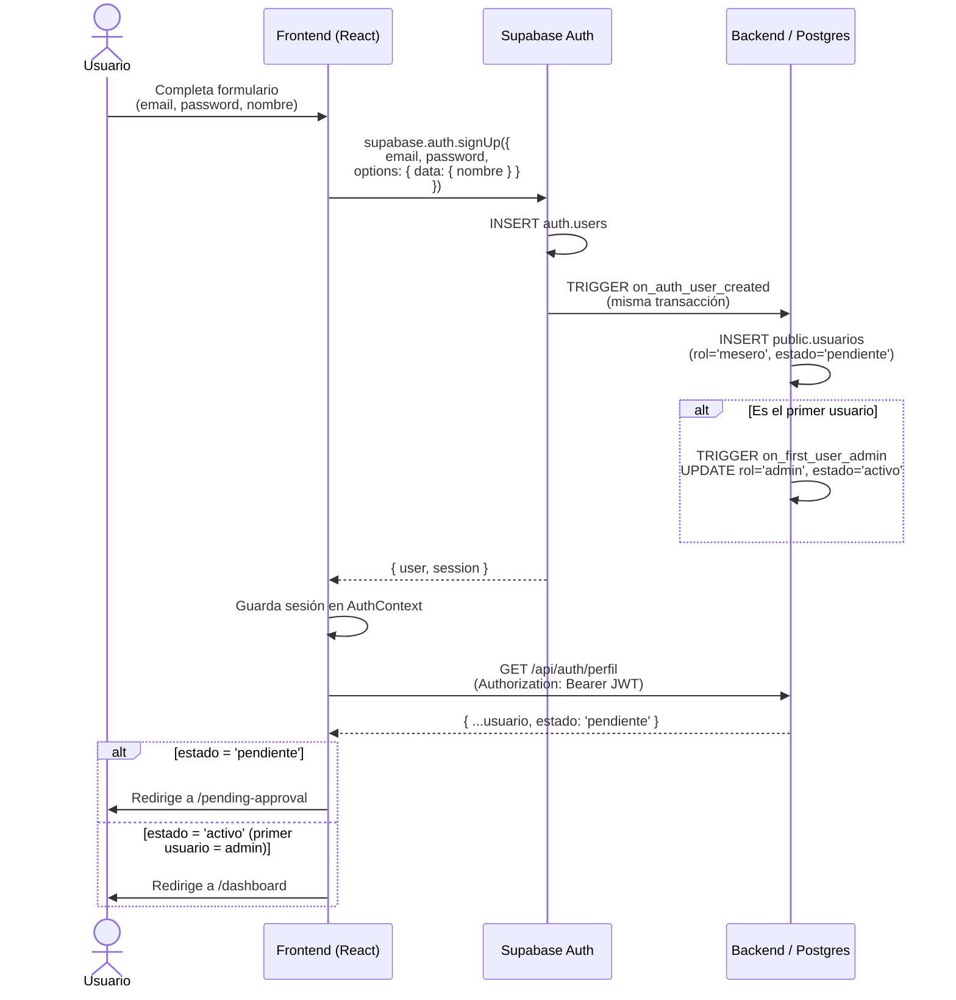
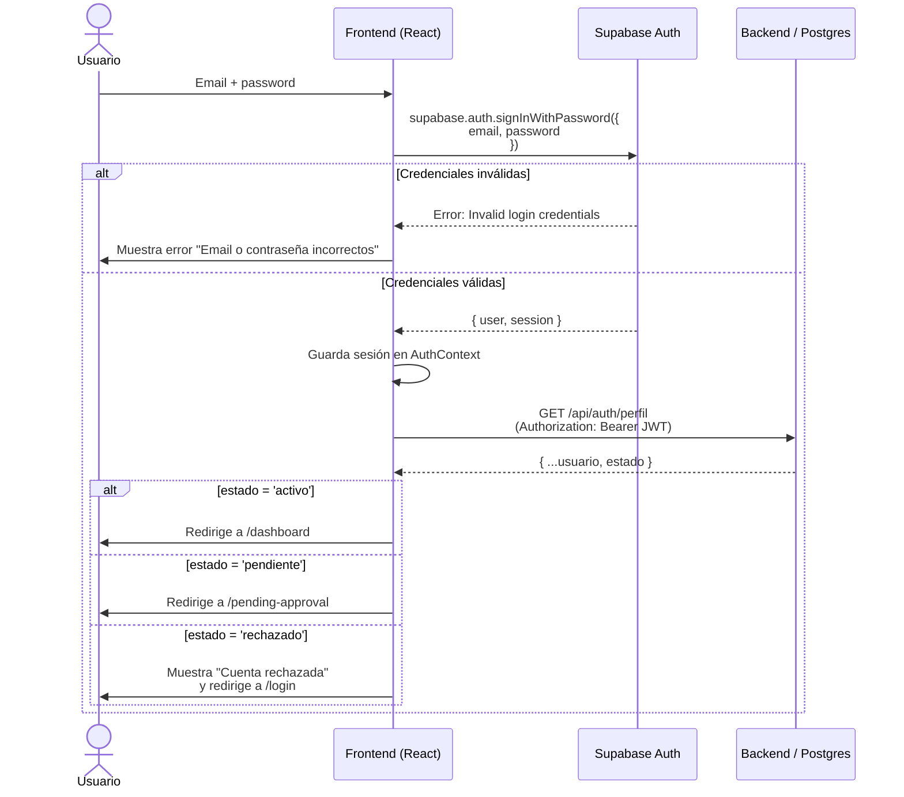
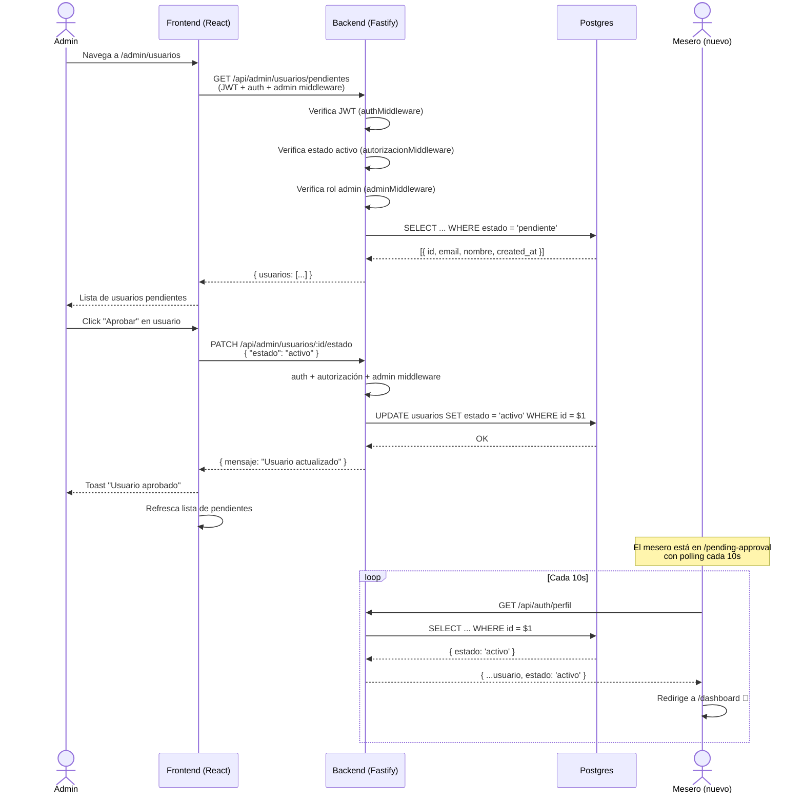
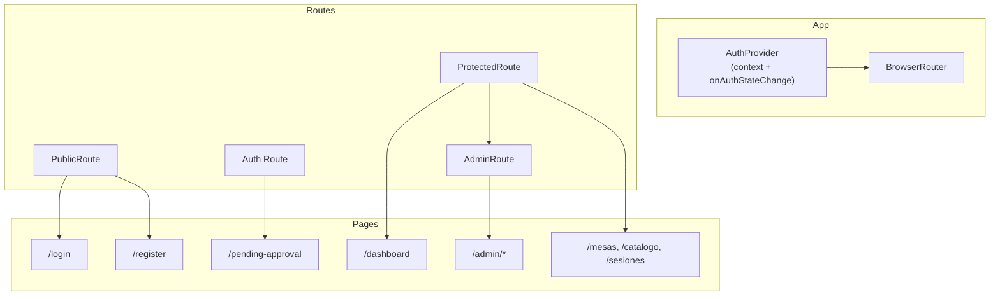
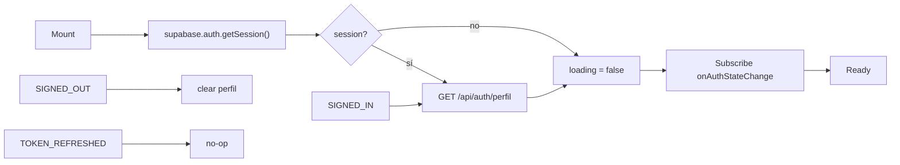
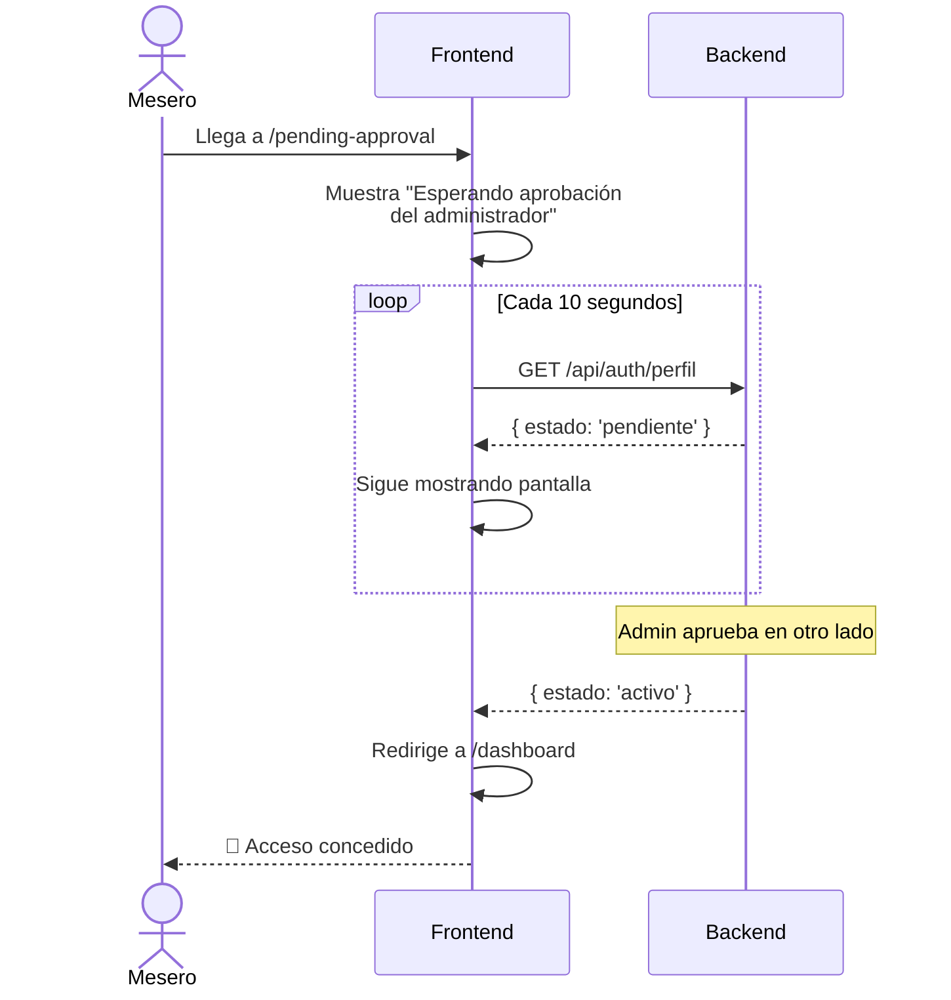

# Flujo de Autenticación — ICE NIGHT ERP

**Stack**: Supabase Auth (frontend directo) + JWT verification (Fastify backend).  
**Patrón**: El frontend habla directo con Supabase Auth para signUp/signIn.  
El backend solo verifica JWTs y maneja datos de negocio.

> **Decisión de arquitectura**: No se proxyan login/register por Fastify.  
> Supabase Auth maneja refresh tokens, password reset y MFA out-of-the-box.  
> El backend se encarga solo de lo que Supabase Auth no puede: datos de negocio en `public.usuarios`.

---

## 1. Flujo de Registro (Sign Up)



### Resumen

| Paso | Descripción |
|------|-------------|
| 1 | Usuario completa formulario de registro (email, password, nombre) |
| 2 | Frontend llama a `supabase.auth.signUp()` con los datos |
| 3 | Supabase crea el usuario en `auth.users` |
| 4 | Trigger `on_auth_user_created` inserta en `public.usuarios` con `estado = 'pendiente'` |
| 5 | Si es el primer usuario, trigger `on_first_user_admin` lo promueve a `admin` + `activo` |
| 6 | Supabase retorna `{ user, session }` al frontend |
| 7 | Frontend obtiene perfil vía `GET /api/auth/perfil` |
| 8 | Según `estado`: redirige a `/pending-approval` o `/dashboard` |

> **Nota sobre email confirmation**: Si Supabase Auth tiene email confirmation habilitado, `signUp()` retorna `{ user, session: null }`. El usuario debe confirmar email antes de obtener sesión. Para v1, recomendar desactivar email confirmation en Supabase Dashboard.

---

## 2. Flujo de Login (Sign In)



### Resumen

| Paso | Descripción |
|------|-------------|
| 1 | Usuario ingresa email + password |
| 2 | Frontend llama a `supabase.auth.signInWithPassword()` |
| 3 | Supabase valida credenciales y retorna `{ user, session }` |
| 4 | Frontend obtiene perfil vía `GET /api/auth/perfil` |
| 5 | Según `estado`: redirige a dashboard, pending-approval, o muestra error |

### Manejo de estados

| `usuario.estado` | Comportamiento |
|:---:|---------------|
| `activo` | Redirige a `/dashboard` — acceso completo |
| `pendiente` | Redirige a `/pending-approval` — esperando aprobación |
| `rechazado` | Muestra toast "Cuenta rechazada" y redirige a `/login` |

---

## 3. Flujo de Aprobación (Admin)



### Endpoints de Admin

| Método | Ruta | Middleware | Descripción |
|--------|------|-----------|-------------|
| `GET` | `/api/admin/usuarios/pendientes` | `auth + autorización + admin` | Lista usuarios pendientes |
| `PATCH` | `/api/admin/usuarios/:id/estado` | `auth + autorización + admin` | Aprueba/rechaza usuario |

### Validaciones del backend

- Solo admin activo puede acceder (3 middlewares en cadena)
- `estado` debe ser `"activo"` o `"rechazado"` (validado por Zod)
- Idempotente: si el usuario ya tiene ese estado, retorna 200 sin errores
- Retorna 404 si el `id` no existe

---

## 4. Route Guards (Frontend)



### `PublicRoute`

```
SI: perfil && perfil.estado === 'activo'
  → Redirige a /dashboard
SINO:
  → Renderiza children (login/register)
```

**Uso**: Envolver páginas de login/register. Si el usuario ya está logueado y activo, no debería ver el login.

### `ProtectedRoute`

```
SI: !session
  → Redirige a /login
SI: session && loading
  → Muestra spinner
SI: perfil?.estado === 'pendiente'
  → Redirige a /pending-approval
SI: perfil?.estado === 'rechazado'
  → Redirige a /login + toast error
SI: perfil?.estado === 'activo'
  → Renderiza <Outlet />
```

**Uso**: Envolver rutas que requieren autenticación + cuenta activa. Es el guard principal.

### `AdminRoute` (o `<RequireRol rol="admin">`)

```
SI: perfil?.rol !== 'admin'
  → Redirige a /dashboard + toast "Acceso denegado"
SINO:
  → Renderiza <Outlet />
```

**Uso**: Envolver rutas administrativas dentro de ProtectedRoute.

---

## 5. Auth State Management

### Context

```typescript
interface AuthContextValue {
  session: Session | null;        // Supabase session
  perfil: Usuario | null;         // from GET /api/auth/perfil
  loading: boolean;               // initial session check
  signOut: () => Promise<void>;
}
```

### Inicialización



### Hooks disponibles

| Hook | Retorna | Descripción |
|------|---------|-------------|
| `useAuth()` | `{ session, perfil, loading, signOut }` | Acceso completo al contexto |
| `usePerfil()` | `Usuario \| null` | Shorthand para perfil |
| `useRol()` | `'admin' \| 'mesero' \| null` | Rol del usuario |
| `useIsAdmin()` | `boolean` | `perfil?.rol === 'admin'` |

### Token Refresh

Supabase maneja auto-refresh automáticamente usando el refresh token almacenado en localStorage. El evento `onAuthStateChange` emite `TOKEN_REFRESHED`. No se necesita lógica adicional — si el refresh falla, Supabase emite `SIGNED_OUT` y el provider limpia el estado.

---

## 6. Pending Approval Page



**Comportamiento**:
- Muestra mensaje amigable "Tu cuenta está pendiente de aprobación"
- Polling a `GET /api/auth/perfil` cada 10 segundos
- Cuando `estado` cambia a `activo`, redirige automáticamente a `/dashboard`
- Cuando `estado` cambia a `rechazado`, muestra mensaje y redirige a `/login`
- Si el usuario cierra sesión, vuelve al login

---

## 7. Riesgos y Mitigaciones

| # | Riesgo | Severidad | Mitigación |
|---|--------|-----------|------------|
| R1 | **Race condition trigger**: `signUp()` retorna sesión pero `on_auth_user_created` aún no insertó en `public.usuarios` | Media | El trigger es transaccional (misma transacción que INSERT en `auth.users`). Para cuando `signUp` retorna, el row debería existir. Igual, `GET /api/auth/perfil` maneja el caso 404. |
| R2 | **Refresh token expirado**: usuario deja la app abierta varios días | Baja | Supabase emite `SIGNED_OUT`. El frontend redirige a `/login`. No hay estado corrupto. |
| R3 | **Admin aprueba mientras usuario está en /pending-approval** | Baja | El polling cada 10s detecta el cambio y redirige al dashboard. |
| R4 | **Admin rechaza usuario ya aprobado** (doble clic) | Baja | El endpoint es idempotente. Retorna 200 aunque ya tenga ese estado. |
| R5 | **Fallo de Supabase Auth** (downtime) | Media | El login va directo a Supabase — no podemos cachear ni fallback. Documentar como parte del SLA esperado. |
| R6 | **JWT válido pero usuario eliminado de public.usuarios** | Baja | `authMiddleware` pasa (JWT válido) pero `autorizacionMiddleware` retorna 403. `GET /api/auth/perfil` retorna 404. Consistente. |
