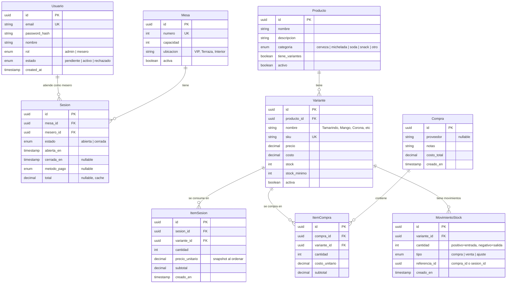

# Domain Exploration — ICE NIGHT ERP

> **Estado**: Completo
> **Propósito**: Análisis de dominio fundacional para informar todos los cambios futuros del SDD
> **Fecha**: 2026-06-13

---

## 1. Domain Narrative

ICE NIGHT es una discoteca. La operación diaria funciona así:

1. Los **meseros** llegan y abren el sistema. Si son nuevos, se registran y el **administrador** (dueño) los aprueba.
2. Los clientes llegan, se sientan en una **mesa**. El mesero **abre una sesión** (cuenta) para esa mesa.
3. Durante la noche, el mesero agrega **consumos** (productos) en **rondas**. Cada consumo lleva el precio del momento.
4. Cuando el cliente pide la cuenta, el mesero la cierra → eso es una **venta**.
5. El **stock** se descuenta al cerrar la cuenta (no al agregar el consumo — el producto ya se sirvió).
6. El administrador **compra inventario** (cervezas, insumos para micheladas, etc.) para reponer stock.
7. El tablero muestra **KPIs del día**: ventas totales, ganancia, productos más vendidos.

---

## 2. Entities & Relationships



---

## 3. Business Rules & Invariants

### Auth
| # | Regla | Rationale |
|---|-------|-----------|
| BR-01 | Un usuario con estado `pendiente` o `rechazado` NO puede iniciar sesión | Seguridad — solo personal aprobado accede |
| BR-02 | El primer usuario registrado es `admin` automáticamente | Seed inicial del sistema |
| BR-03 | Los registros de `mesero` nacen como `pendiente` y requieren aprobación del admin | Control de acceso del dueño |
| BR-04 | Admin puede cambiar estado de un mesero a `activo` o `rechazado` | Workflow de aprobación |

### Ventas (Sesiones)
| # | Regla | Rationale |
|---|-------|-----------|
| BR-05 | Una mesa puede tener UNA sola sesión `abierta` a la vez | Integridad — no mezclar cuentas |
| BR-06 | Una sesión cerrada NO se puede reabrir | Integridad contable |
| BR-07 | El precio se congela al agregar el consumo (snapshot) | El precio puede cambiar entre rondas |
| BR-08 | Al cerrar sesión: verificar stock → descontar stock → marcar cerrada (transaccional) | Atomicidad — evitar descuentos parciales |
| BR-09 | Si NO hay stock suficiente para TODOS los items, la transacción entera falla | Consistencia de inventario |

### Catálogo
| # | Regla | Rationale |
|---|-------|-----------|
| BR-10 | Un producto con `tiene_variantes=true` requiere seleccionar variante para vender | Ej: elegir sabor de michelada |
| BR-11 | Producto sin variantes tiene una variante implícita (default) | Simplifica el modelo — siempre vendemos variantes |
| BR-12 | `producto.nombre + variante.nombre` debe ser único | No duplicados confusos |
| BR-13 | Productos y variantes se desactivan (no se eliminan) para no romper histórico | Integridad referencial de ventas pasadas |

### Inventario
| # | Regla | Rationale |
|---|-------|-----------|
| BR-14 | Toda compra aumenta stock de la variante | Reposición |
| BR-15 | Toda venta (sesión cerrada) disminuye stock de la variante | Consumo |
| BR-16 | Cada cambio de stock genera un `MovimientoStock` | Auditoría completa |
| BR-17 | Si `stock <= stock_minimo`, se genera alerta de stock bajo | El dashboard debe mostrar estas alertas |
| BR-18 | Stock NUNCA puede ser negativo | Invariante físico — no vendes lo que no tenés |

---

## 4. Ubiquitous Language (Spanish)

| Español (Dominio) | Inglés (Código) | Descripción |
|-------------------|-----------------|-------------|
| **Usuario** | `User` | Persona que usa el sistema |
| **Administrador** | `Admin` | Dueño del nightclub |
| **Mesero** | `Waiter` | Empleado que atiende mesas |
| **Mesa** | `Table` | Mesa física en la discoteca |
| **Sesión** | `Session` | Cuenta abierta en una mesa (también "la cuenta") |
| **Consumo / Item de Sesión** | `SessionItem` | Producto consumido en una mesa |
| **Ronda** | `Round` | Grupo de consumos agregados juntos |
| **Venta** | `Sale` | Sesión cerrada y pagada |
| **Producto** | `Product` | Item del catálogo (cerveza, michelada, etc.) |
| **Variante** | `Variant` | Especificación de un producto (sabor, marca, tipo) |
| **Compra** | `Purchase` | Reposición de inventario |
| **Item de Compra** | `PurchaseItem` | Producto comprado en una reposición |
| **Movimiento de Stock** | `StockMovement` | Registro de entrada/salida de inventario |
| **Stock Mínimo** | `MinStock` | Umbral para alerta de reposición |
| **Cerrar Cuenta** | `CloseSession` | Proceso de cobro y cierre |
| **Abrir Cuenta** | `OpenSession` | Iniciar sesión en una mesa |
| **Método de Pago** | `PaymentMethod` | Efectivo, tarjeta, transferencia, etc. |
| **Tablero** | `Dashboard` | KPIs y métricas del negocio |
| **Alerta de Stock** | `StockAlert` | Notificación cuando stock < mínimo |

### Convención para naming en el código

**Entidades de dominio** (carpetas/clases): en español, porque:
- El lenguaje ubicuo del negocio es español
- Hace el código auto-documentado para el equipo
- Evita traducciones mentales entre el dominio real y el código

```
src/
  domain/
    usuario/          # User entity + value objects
    producto/         # Product entity
    variante/         # Variant entity
    mesa/             # Table entity
    sesion/           # Session entity
    compra/           # Purchase entity
    movimiento-stock/ # Stock movement entity
```

**Use Cases / Casos de Uso**: verbo en español

```
application/
  usar cases/
    auth/
      Registrarse.ts           # Register
      IniciarSesion.ts         # Login
      AprobarUsuario.ts        # ApproveUser
    catalog/
      CrearProducto.ts         # CreateProduct
      CrearVariante.ts         # CreateVariant
    sesion/
      AbrirSesion.ts           # OpenSession
      AgregarConsumo.ts        # AddSessionItem
      CerrarSesion.ts          # CloseSession
    inventory/
      RegistrarCompra.ts       # RegisterPurchase
```

**Interfaces / tipos compartidos**: en inglés para consistencia técnica

```
types/
  request.ts     # Request DTOs
  response.ts    # Response DTOs
  errors.ts      # Domain errors
```

---

## 5. Module Dependency Graph

```
                    ┌──────────────┐
                    │   Auth       │  ← Sin dependencias
                    │  (usuarios)  │
                    └──────┬───────┘
                           │
                    ┌──────▼───────┐
                    │  Catalog     │  ← Depende de Auth (admin CRUD)
                    │ (productos,  │
                    │  variantes)  │
                    └──────┬───────┘
                           │
              ┌────────────┼────────────┐
              │            │            │
       ┌──────▼──────┐    │    ┌───────▼───────┐
       │   Tables    │    │    │   Inventory    │
       │   (mesas)   │    │    │  (compras,     │
       └──────┬──────┘    │    │   movimientos) │
              │           │    └───────┬───────┘
              │           │            │
       ┌──────▼───────────┴────────────▼───────┐
       │          Sessions (sesiones)           │
       │  Depende de: Catalog, Tables, Auth     │
       └──────┬────────────────────────────┬────┘
              │                            │
       ┌──────▼──────┐          ┌─────────▼────────┐
       │  Dashboard  │          │      Auth (2)     │
       │  (KPIs,     │          │  (middleware de    │
       │   reports)  │          │   roles para todo) │
       └─────────────┘          └───────────────────┘
```

### Orden de implementación (cambios)

```
Change 1:  Auth ───┐
                    ├── sin dependencias
Change 0: Scaffold ─┘
     │
Change 2: Catalog ─────── depende de Auth
     │
Change 3: Tables + Sessions ── depende de Catalog + Auth
     │
Change 4: Inventory ───────── depende de Catalog
     │
Change 5: Dashboard ───────── depende de Sessions + Inventory
```

---

## 6. Technical Risks

### Risk R-01: JWT + pending flow (HIGH)

**Problema**: El middleware JWT debe:
1. Verificar firma y expiración del token
2. Verificar que el usuario no esté `pendiente` ni `rechazado`
3. Pero las rutas de auth (login, register) deben funcionar para usuarios pendientes

**Solución propuesta**:
- Middleware de autenticación: solo verifica que el token sea válido
- Middleware de autorización: verifica `status === 'activo'`
- Las rutas públicas de auth usan solo el middleware de autenticación (o ninguno)
- Las rutas protegidas usan AMBOS middlewares

```
fastify.post('/api/auth/login', handler)                    // sin middleware
fastify.post('/api/auth/register', handler)                 // sin middleware
fastify.get('/api/sesiones', { preHandler: [auth, active] }, handler)
```

### Risk R-02: Tab total en tiempo real (MEDIUM)

**Problema**: ¿Cómo se calcula el total de una sesión abierta?

**Opciones**:
1. **Calcular en cada GET** (`SUM(item_sesion.subtotal)`) — simple, siempre actualizado, sin estado redundante
2. **Cachear en `sesion.total`** con trigger/update — más rápido para leer, pero puede desincronizarse

**Recomendación**:
- Para v1: calcular en cada GET. Postgres hace SUM rápido con índice en `sesion_id`.
- Para v2 si hay carga: añadir columna `sesion.total` actualizada por trigger.

### Risk R-03: Stock deduction race condition (HIGH)

**Problema**: Cuando dos sesiones se cierran al mismo tiempo, pueden leer stock, ver que hay suficiente, y ambos descontar — llevando a negativo.

**Solución**: Usar `SELECT ... FOR UPDATE` en la transacción de cierre:

```sql
BEGIN;
SELECT stock FROM variante WHERE id = $1 FOR UPDATE;
-- verificar stock >= cantidad
UPDATE variante SET stock = stock - $2 WHERE id = $1;
INSERT INTO movimiento_stock (...);
UPDATE sesion SET estado = 'cerrada', total = $3 WHERE id = $4;
COMMIT;
```

### Risk R-04: Snapshot de precios (LOW)

**Problema**: Un producto cambia de precio. Las sesiones abiertas tienen items con precio viejo. ¿Qué pasa?

**Solución**: El precio se guarda en `item_sesion.precio_unitario` al crear el consumo. Es correcto — cada ronda se cobra al precio de ese momento. El dueño debe entender que las sesiones abiertas NO se actualizan con el nuevo precio.

### Risk R-05: Concurrent session open (LOW)

**Problema**: Dos meseros intentan abrir sesión en la misma mesa simultáneamente.

**Solución**: Unique constraint parcial en `sesion(mesa_id)` WHERE `estado = 'abierta'`. Postgres lo enforcea a nivel BD.

---

## 7. Database Schema Key Decisions

### Tablas principales

```sql
-- Enforce: una sesión abierta por mesa
CREATE UNIQUE INDEX idx_sesion_mesa_abierta
  ON sesion (mesa_id) WHERE estado = 'abierta';

-- Snapshot de precio en item_sesion
ALTER TABLE item_sesion ALTER COLUMN precio_unitario SET DEFAULT 0;
-- El use case llena esto con el precio actual de la variante

-- Stock mínimo con default
ALTER TABLE variante ALTER COLUMN stock_minimo SET DEFAULT 5;
ALTER TABLE variante ALTER COLUMN stock SET DEFAULT 0;

-- MovimientoStock: cantidad positiva = entrada, negativa = salida
ALTER TABLE movimiento_stock ADD CONSTRAINT check_cantidad_no_cero
  CHECK (cantidad != 0);
```

### Sobre el método de pago nullable

Se deja nullable porque:
- Se setea al cerrar la sesión
- En v1 puede no usarse
- Futuras integraciones (POS, link de pago) pueden requerirlo

---

## 8. v1 Core — Recommended First Change Boundaries

### Change 0: Scaffold

- `package.json` (workspaces: frontend + backend)
- TypeScript config (strict, nodenext)
- Fastify app bootstrap con health check
- Supabase Postgres connection pool
- ESLint + Prettier
- Folder structure (Clean Architecture)
- **Sin features** — solo infraestructura base

### Change 1: Auth Module

Tamaño estimado: **Media** (~350 líneas backend)

| Capa | Archivos |
|------|----------|
| Domain | `Usuario`, `ValueObjects` (Email, Rol, EstadoUsuario) |
| Application | `Registrarse`, `IniciarSesion`, `AprobarUsuario` |
| Infrastructure | `UsuarioRepository` (Supabase), `JwtService` |
| Presentation | `POST /auth/register`, `POST /auth/login`, `PATCH /auth/aprobar` |

### Change 2: Catalog Module

Tamaño estimado: **Media** (~300 líneas backend)

| Capa | Archivos |
|------|----------|
| Domain | `Producto`, `Variante` |
| Application | `CrearProducto`, `CrearVariante`, `DesactivarProducto` |
| Infrastructure | `ProductoRepository`, `VarianteRepository` |
| Presentation | `CRUD /productos`, `CRUD /variantes` |

### Change 3: Tables & Sessions

Tamaño estimado: **Alta** (~500 líneas backend) — el core del negocio

| Capa | Archivos |
|------|----------|
| Domain | `Mesa`, `Sesion`, `ItemSesion` |
| Application | `AbrirSesion`, `AgregarConsumo`, `CerrarSesion`, `ObtenerCuenta` |
| Infrastructure | `MesaRepository`, `SesionRepository` |
| Presentation | `POST /mesas/:id/abrir`, `POST /sesiones/:id/items`, `POST /sesiones/:id/cerrar`, `GET /sesiones/:id` |

### Change 4: Inventory Module

Tamaño estimado: **Baja-Media** (~250 líneas backend)

| Capa | Archivos |
|------|----------|
| Domain | `Compra`, `ItemCompra`, `MovimientoStock` |
| Application | `RegistrarCompra`, `ObtenerAlertasStock` |
| Infrastructure | `CompraRepository`, `MovimientoRepository` |
| Presentation | `POST /compras`, `GET /alertas-stock` |

### Change 5: Dashboard

Tamaño estimado: **Baja** (~150 líneas backend + queries SQL)

| Capa | Archivos |
|------|----------|
| Application | `ObtenerDashboardDiario`, `ObtenerTopProductos` |
| Infrastructure | Queries SQL directas en repositorio |
| Presentation | `GET /dashboard/hoy`, `GET /dashboard/top-productos` |

### Change 6: Frontend (PWA React)

Tamaño estimado: **Alta** (~1500 líneas frontend total)

- Login / Registro (auth)
- ABM de productos
- Gestión de mesas
- Panel de mesero (abrir/cerrar sesiones, agregar consumos)
- Dashboard con KPIs
- Alertas de stock

---

## 9. Delivery Strategy Forecast

| Change | Estimated Lines | 400-Line Budget Risk | Chained PR? |
|--------|----------------|----------------------|-------------|
| 0. Scaffold | ~100 | Low | No |
| 1. Auth | ~350 | Medium | No |
| 2. Catalog | ~300 | Low | No |
| 3. Tables+Sessions | ~500 | **High** | **Yes** (split: tables vs sessions) |
| 4. Inventory | ~250 | Low | No |
| 5. Dashboard | ~150 | Low | No |
| 6. Frontend | ~1500 | **High** | **Yes** (split: auth UI, catalog UI, operations UI, dashboard) |

Change 3 debe dividirse en:
- **3a**: Mesas CRUD + Abrir/Cerrar sesión (sin items aún)
- **3b**: Items de sesión + cálculos + cierre con descuento de stock

---

## 10. Ready for Proposal

**Sí** — el dominio está claro, las entidades están identificadas, los riesgos están documentados, y las fronteras de cambios están definidas.

Lo que sigue:
1. Definir el **primer cambio** — recomiendo empezar por **`scaffold`** (Change 0) para tener la base técnica
2. Luego **`auth`** (Change 1) — indispensable para todo lo demás
3. Después **`catalog`** (Change 2) → **`sessions`** (Change 3) → **`inventory`** (Change 4) → **`dashboard`** (Change 5)

**Pregunta al usuario**: ¿Querés que arranquemos con el primer cambio (`scaffold`) o preferís ajustar algo de este análisis antes de seguir?
